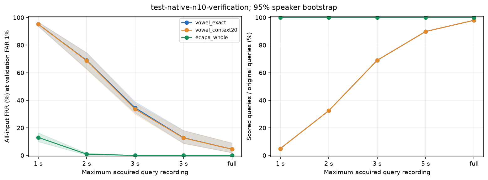
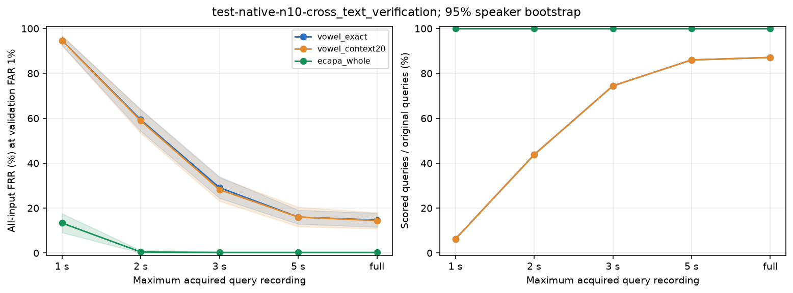
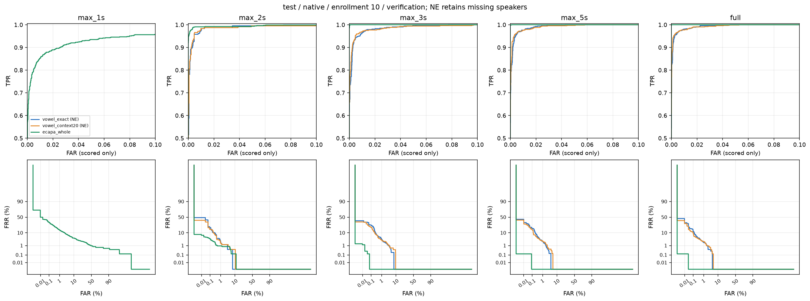

# Phase 7: 固定閾値test比較結果

**主条件ではECAPAが優位だった。** 全入力FRRの方式差の95% CIは0を含まない。文脈拡張による改善はこの主条件では明確でない。

[ブラウザ用の比較表](evaluation-results.html)では主要結果・比較条件・方式差・長さ別の結果を確認できる。全条件の絞り込み・並べ替え・件数/CIの詳細表示にも対応する。実行日: 2026-10-07（JST）。

3方式・5長さ・登録数1/5/10・通常/別テキスト・native/commonを全件評価した。閾値はvalidationの通常発話で決め、testでは変更していない。

主条件は登録各母音10、full、native、validation目標FAR 1%。

|role|方式|coverage|条件付きFAR|条件付きFRR|全入力FRR [95% CI]|EER|
|---|---|---:|---:|---:|---:|---:|
|verification|vowel_exact|98.000%|0.729%|2.585%|4.533% [2.000%, 8.933%]|1.526%|
|verification|vowel_context20|98.000%|0.661%|2.585%|4.533% [2.000%, 9.200%]|1.497%|
|verification|ecapa_whole|100.000%|0.619%|0.000%|0.000% [0.000%, 0.000%]|0.029%|
|cross_text_verification|vowel_exact|87.111%|0.838%|2.041%|14.667% [11.556%, 17.778%]|1.257%|
|cross_text_verification|vowel_context20|87.111%|0.856%|1.786%|14.444% [10.889%, 18.000%]|1.239%|
|cross_text_verification|ecapa_whole|100.000%|0.365%|0.222%|0.222% [0.000%, 0.667%]|0.222%|

## 長さ比較（native、登録10、全入力FRR）

|role|方式|1秒|2秒|3秒|5秒|full|
|---|---|---:|---:|---:|---:|---:|
|verification|vowel_exact|95.200%|68.933%|34.533%|12.800%|4.533%|
|verification|vowel_context20|95.200%|68.667%|33.600%|12.667%|4.533%|
|verification|ecapa_whole|13.067%|0.933%|0.000%|0.000%|0.000%|
|cross_text_verification|vowel_exact|94.667%|59.333%|29.111%|16.000%|14.667%|
|cross_text_verification|vowel_context20|94.667%|58.889%|28.222%|16.000%|14.444%|
|cross_text_verification|ecapa_whole|13.333%|0.444%|0.222%|0.222%|0.222%|

## 方式差（全入力FRR、percentage points）

|role|比較|差|95% CI|
|---|---|---:|---:|
|verification|vowel_context20 − vowel_exact|0.000|[-0.400, 0.400]|
|verification|ecapa_whole − vowel_exact|-4.533|[-8.933, -2.000]|
|cross_text_verification|vowel_context20 − vowel_exact|-0.222|[-0.889, 0.444]|
|cross_text_verification|ecapa_whole − vowel_exact|-14.444|[-17.556, -11.333]|

## 全成果物

- [全360条件・3動作点・件数・CI](all-conditions.csv)
- [元発話長と実利用時間の全層](duration-strata.csv)
- [全方式差・長さ差のpaired CI](paired-differences.csv)
- [全条件のROC/DET・長さ曲線・固定5秒以上集合](evaluation-results.html)

共通入力は5母音が揃うqueryの交差集合。短いcapほど選択率が下がり、条件付き指標が改善しても全入力への改善とは限らない。全入力FRRではno_scoreを拒否として数える。各話者・roleのscore不足時は条件付きFRR/FAR・EER/ROC/DET・条件付きCIを評価不能とし、全入力値とcoverageは保持した。実利用時間はscoreなしqueryで0秒とし、利用可能なanchor量と区別した。

ECAPAはVoxCeleb事前学習・20,767,552 parameters、母音方式はJVS 70話者学習・65,920 parametersで、入力範囲、目的関数、集約も異なる。方式としての比較であり、音素分割の因果効果やパラメータ数の効果は切り分けられない。

JVSの管理された録音条件での結果。別日・別端末・雑音・なりすまし耐性は評価していない。Phase 3/6でtestが既に参照されており、新規の独立holdoutではない。speaker CIは学習・閾値較正の不確かさを含まない。誤り0件のbootstrap区間が[0,0]でも母集団の誤り確率0を保証しない。低FARは試行分解能・件数と併せて読む。全層の空集合・支持不足は省略せずNEとした。

## 主比較の図

帯は固定閾値での全入力FRRの95%話者bootstrap区間。1秒ではECAPAも本人拒否が約13%となり、2秒で約1%以下へ低下した。
これはこのモデル・JVS・固定登録profile・中央cropでの長さ診断であり、任意の短録音の精度保証ではない。
母音方式の1秒条件はtest通常文37/750、別テキスト28/450でしか5母音を取得できず、全入力FRRが約95%となる。
通常文・別テキストの1秒条件では母音2方式の条件付き指標、およびcommonの全方式の条件付き指標を評価不能とした。

ROC/DETはscoreがあるtrialのみ。評価不能の条件はNEと表示する。実行成果物の全条件図は描画点を間引くが、全点のJSONLも保持する。リポジトリの主要2 ROC/DET図は全点で再描画し、軸ラベルの重なりを解消した。
全文・両role・両support・登録1/5/10の60図をPNG/PDFで保存した。ブラウザ版には主要図と全60図の実行成果物レポートへのリンクがある。
主要6図はリポジトリにも保持し、残りはローカル実行成果物を参照する。

## 共通入力による補助比較

登録10・fullのcommonは通常文735 query（元集合の98.000%）、別テキスト392 query（87.111%）。
この集合のFAR 1%動作点で、通常文の条件付きFRRは境界内2.585%、文脈付き2.585%、ECAPA 0.000%。
別テキストは境界内2.041%、文脈付き1.786%、ECAPA 0.000%。ECAPAの実測FARは通常文0.622%、別テキスト0.401%。
母音不足の有無だけで主条件の差が生じているわけではない。ただしcommonは音声条件で選択された補助集合であり、
nativeでECAPAが拒否した別テキスト1件も含まれない。capごとにcommon集合が変わるため、cap−full差には集合変更も含む。
元発話5秒以上の固定query集合の長さ比較は、native閾値をそのまま使って別途保存した。

## モデルと利用音声量の差

取得できる元WAVとquery recording windowを共通にし、登録profileは全capで固定した。
内部で使う音声量を等しくした実験ではない。ECAPAは母音anchorを含む元WAV全体を登録に使うため、特に登録側の差が大きい。
以下はtest・登録10での、重複frameを1回だけ数えた利用時間の中央値。母音queryのno_scoreは実利用0秒として含む。

|方式|parameter数|学習|登録/話者|通常文query|別テキストquery|
|---|---:|---|---:|---:|---:|
|境界内母音|65,920|JVS train 70話者|4.000秒|2.935秒|1.570秒|
|文脈付き母音|65,920|同じ固定encoder|5.970秒|4.055秒|2.280秒|
|ECAPA|20,767,552|VoxCeleb事前学習|241.768秒|7.776秒|4.560秒|

登録元WAV数の中央値は33本（範囲31〜37）で、3方式とも同じanchor由来のWAV集合を利用する。
queryの取得時間と内部のunique/processed frameは`inputs.json`、実際の推論範囲とPCM hashは方式別`embedding-inputs.jsonl`に保持する。
文脈波形の重複はunique frameで除き、演算量のprocessed frameとは分ける。
長さ診断ではfullのalignment metadataを中央cropへclipし、短縮波形を再alignmentしない。録音からalignmentを含む短発話システム全体の評価ではない。

## 凍結・実行・検証の証跡

実行成果物は`artifacts/phoneme-baseline-comparison/test-20261007-v2`。
`execution-freeze.json`へ設計・protocol・実装/テストsnapshot・lock・重み/特徴統計・全WAV・入力metadata・全validation成果物・resource planを固定した。
凍結時点で新方式のtest推論およびPhase 6 test score内容の参照は未実施。Phase 3/6での参照歴は上記の通り残る。
`verification.json`の57 unit tests・Ruff lint/format通過後に凍結し、固定270閾値を適用した。

|成果物|確認内容|
|---|---|
|`test-report.json`|`status=completed`、test 15話者/1,200query/810,000 score slots/135 profiles|
|`vowels/report.json`|45境界内profile・54,000 full trialがPhase 6と一致、最大score差0、公開APIとの12,000照合が一致|
|`ecapa/report.json`|45profile、6,172固有embedding、全入力3回の完全一致、モデルparameter/buffer不変|
|`test-metrics.json`|180 test条件、792 paired差、共有10,000 draws、閾値の再校正なし|
|`test-checks.json`|540動作点をraw scoreから独立再計数、分母/固定閾値/全CI/NE規則/hash確認|
|`report/manifest.json`|全360条件×3動作点=1,080行、9,720層別行、792差、60 PNG/60 PDFのhash|

validationは810,000 slot（587,430 scored、222,570 no_score）、testは810,000 slot（589,050 scored、220,950 no_score）。
validationの条件付き評価不能は15条件、testは30条件。NEの条件名・話者・件数はmetrics JSONと全条件CSVに保存した。
10,000 drawsはPhase 6と完全一致し、境界内fullの全6条件・全動作点/EERと78本のCIもPhase 6と完全一致した。

test worker時間は母音2方式で144.95秒（82,471固有embedding）、ECAPAで611.17秒（6,172固有embedding）。
model load・反復3回・profile/score・音声/不変/API検査を含む工程時間で、1認証のlatencyではない。
warmupを分けた単発ECAPA推論の小規模測定は[動作確認結果](smoke-results.md)を参照する。

再現コマンドと前提成果物は[README](README.md)、
設計は[比較設計2.0.0](comparison-design.md)、設定は[test config](config/test.json)。
生score/embedding/bootstrap NPZ/全曲線はGit管理外、全条件CSV・主図・本資料はGit管理対象として分けて保存する。

## Issue #45の完了条件

- [x] 発話全体・境界内母音・文脈付き母音の設計、固定config、runner、結果を専用ディレクトリに配置。
- [x] Phase 6のsplit/登録/query/genuine/impostorを共有し、登録量・query長・欠測・学習条件差を記録。
- [x] 新方式のtest推論前に実行凍結し、validation通常文の閾値を固定適用。
- [x] 通常文/別テキスト・登録1/5/10・全cap・native/commonの全条件、FAR/FRR/EER/coverage/件数/ROC/DETを保存。
- [x] 10,000回の話者CIとpaired方式差/長さ差、元発話長/実利用時間の層、固定5秒以上集合を保存。
- [x] 音声・モデル・入力・score・閾値・実装の追跡、反復再現性、既存API/Phase 6一致、不変確認、テスト、最終監査を完了。
- [x] README/研究設計へ結論と限界を反映。将来の別日/別端末評価はこのJVS比較の対象外。

主図の表示改訂は`artifacts/phoneme-baseline-comparison/publication-20261007-v1/manifest.json`へ記録した。凍結済みtest runは変更せず、[表示用runner](scripts/render_publication_roc.py)で同じ曲線を再描画した。
