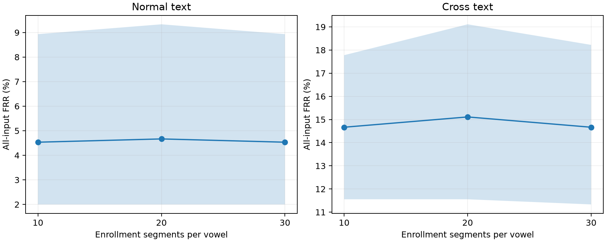

# Phase 8: 母音の登録10・20・30区間の実測比較

固定した境界内母音encoderを使い、同じ照合発話内の全利用可能母音で照合した。5母音必須・等重み統合は変更せず、登録区間数だけを変えた。閾値は登録数ごとにvalidation通常文で決定し、通常文・別テキストの評価へ固定適用した。

既に観測済みのJVS testを用いた探索的な追加検証。新しい独立holdoutの評価ではなく、別日・別端末の性能は未確認。CIは固定モデル・固定閾値での話者bootstrapで、学習・閾値校正の不確かさを含まない。

## 通常文（validation目標FAR 1%）

|各母音の登録区間数|条件付きFAR|条件付きFRR|全入力FRR|全入力FRR 95% CI (%)|EER|coverage|他人誤受入/scoreあり|本人誤拒否/scoreあり|本人no_score/全入力|
|---|---|---|---|---|---|---|---|---|---|
|10|0.729%|2.585%|4.533%|[2.000, 8.933]|1.526%|98.000%|75/10290|19/735|15/750|
|20|0.680%|2.721%|4.667%|[2.000, 9.333]|1.419%|98.000%|70/10290|20/735|15/750|
|30|0.671%|2.585%|4.533%|[2.000, 8.933]|1.273%|98.000%|69/10290|19/735|15/750|

## 別テキスト（validation目標FAR 1%）

|各母音の登録区間数|条件付きFAR|条件付きFRR|全入力FRR|全入力FRR 95% CI (%)|EER|coverage|他人誤受入/scoreあり|本人誤拒否/scoreあり|本人no_score/全入力|
|---|---|---|---|---|---|---|---|---|---|
|10|0.838%|2.041%|14.667%|[11.556, 17.778]|1.257%|87.111%|46/5488|8/392|58/450|
|20|0.784%|2.551%|15.111%|[11.556, 19.111]|1.166%|87.111%|43/5488|10/392|58/450|
|30|0.601%|2.041%|14.667%|[11.333, 18.222]|1.002%|87.111%|33/5488|8/392|58/450|

## 登録数による差

負の値は本人拒否率の減少。共有した10,000回の話者抽出で算出した。

|発話条件|比較|全入力FRR差 (pp)|95% paired CI (pp)|
|---|---|---|---|
|通常文|n20_minus_n10|0.133|[0.000, 0.400]|
|通常文|n30_minus_n10|0.000|[0.000, 0.000]|
|通常文|n30_minus_n20|-0.133|[-0.400, 0.000]|
|別テキスト|n20_minus_n10|0.444|[-0.444, 1.556]|
|別テキスト|n30_minus_n10|0.000|[-0.667, 0.667]|
|別テキスト|n30_minus_n20|-0.444|[-1.111, 0.000]|

## 登録音声量

|split|各母音の登録区間数|元WAV数 中央値|元WAV総時間 中央値 (s)|内部利用時間 中央値 (s)|
|---|---|---|---|---|
|validation|10|34|238.118|3.520|
|validation|20|46|341.325|7.310|
|validation|30|50|351.765|11.200|
|test|10|33|241.768|4.000|
|test|20|47|335.927|7.870|
|test|30|50|362.053|11.290|

元WAV総時間は今回選択した録音の合計時間で、最短の必要録音時間ではない。内部利用時間は250 ms crop後の音声の和集合。登録区間数を増やしても、照合発話の5母音不足は解消しない。

## 図と全動作点

[全12条件・3動作点・件数・CI](all-conditions.csv)、[全72 paired差](paired-differences.csv)、[HTML比較表](evaluation-results.html)。

- validation: 45 profiles、54,000 slots、42,679固有embedding、工程時間58.98秒。全embeddingを3回反復し完全一致。
- test: 45 profiles、54,000 slots、42,524固有embedding、工程時間58.31秒。全embeddingを3回反復し完全一致。

工程時間はモデル読込、反復推論、公開API検査、profile生成、全trial照合を含み、1認証のlatencyではない。

登録10の全30 profileと36,000 trial、validation閾値、通常文/別テキストのtest指標・CIはPhase 7までの結果と一致。重み・特徴統計・元音声は変更していない。生score・embedding・bootstrap・凍結記録は実行成果物に保存。

実行成果物: `artifacts/phoneme-enrollment-scaling/enrollment-20261008-v1`。再現手順は[README](README.md)、条件は[protocol](config/protocol.json)。
