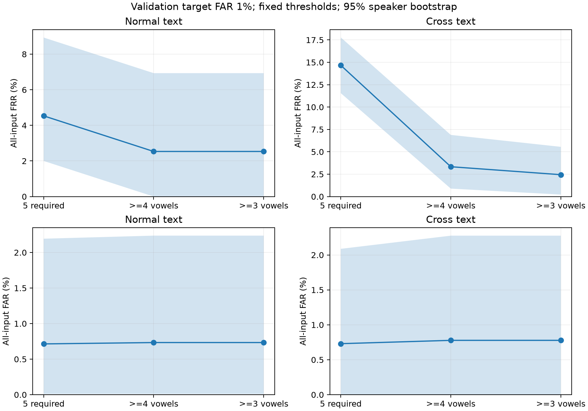

# Phase 8: 照合時の母音不足に対応する実測比較

登録は各母音10区間・固定境界内母音encoderを使用。同じ発話全区間で、5母音必須・4母音以上・3母音以上を比較した。取得できた母音のsegment cosineを母音内で平均し、存在する母音のscoreだけを等重み平均する。各方式のvalidation通常文で校正した閾値をtestへ固定適用した。

観測済みJVS testによる探索的な追加検証。再学習・品質重み・Transformer・本番APIの切り替えは行っていない。3母音の通常文validationデータはなく、3母音以上と4母音以上の閾値は同じ。未観測holdout、別日・別端末の性能は未確認。CIは固定モデル・固定閾値の10,000回話者bootstrapで、校正の不確かさと多重比較の補正は含まない。

## 通常文（validation目標FAR 1%）

FARとFRRの条件付き分母はscoreが出たtrial。全入力FRRにはno_scoreも拒否として含める。

|方式|条件付きFAR|全入力FAR|条件付きFRR|全入力FRR|全入力FRR 95% CI (%)|EER|coverage|他人誤受入/scoreあり|本人誤拒否/scoreあり|本人no_score/全入力|
|---|---|---|---|---|---|---|---|---|---|---|
|5母音必須|0.729%|0.714%|2.585%|4.533%|[2.000, 8.933]|1.526%|98.000%|75/10290|19/735|15/750|
|4母音以上|0.733%|0.733%|2.533%|2.533%|[0.000, 6.933]|1.543%|100.000%|77/10500|19/750|0/750|
|3母音以上|0.733%|0.733%|2.533%|2.533%|[0.000, 6.933]|1.543%|100.000%|77/10500|19/750|0/750|

## 別テキスト（validation目標FAR 1%）

FARとFRRの条件付き分母はscoreが出たtrial。全入力FRRにはno_scoreも拒否として含める。

|方式|条件付きFAR|全入力FAR|条件付きFRR|全入力FRR|全入力FRR 95% CI (%)|EER|coverage|他人誤受入/scoreあり|本人誤拒否/scoreあり|本人no_score/全入力|
|---|---|---|---|---|---|---|---|---|---|---|
|5母音必須|0.838%|0.730%|2.041%|14.667%|[11.556, 17.778]|1.257%|87.111%|46/5488|8/392|58/450|
|4母音以上|0.787%|0.778%|2.247%|3.333%|[0.889, 6.889]|1.268%|98.889%|49/6230|10/445|5/450|
|3母音以上|0.778%|0.778%|2.444%|2.444%|[0.222, 5.556]|1.254%|100.000%|49/6300|11/450|0/450|

## 厳しい動作点（validation目標FAR 0.1%）

目標値はvalidationの校正条件であり、testの実測FARが同じになるとは限らない。

|発話条件|方式|条件付きFAR|全入力FAR|全入力FRR|他人誤受入/scoreあり|本人誤拒否+no_score/全入力|
|---|---|---|---|---|---|---|
|通常文|5母音必須|0.097%|0.095%|14.533%|10/10290|94+15/750|
|通常文|4母音以上|0.105%|0.105%|12.667%|11/10500|95+0/750|
|通常文|3母音以上|0.105%|0.105%|12.667%|11/10500|95+0/750|
|別テキスト|5母音必須|0.055%|0.048%|28.444%|3/5488|70+58/450|
|別テキスト|4母音以上|0.048%|0.048%|18.889%|3/6230|80+5/450|
|別テキスト|3母音以上|0.048%|0.048%|18.000%|3/6300|81+0/450|

## 本人救済と他人受入の内訳（主条件、対5母音必須）

5母音揃う発話のscoreは全方式で同じ。既存発話の判定差は方式ごとの固定閾値の違いによる。

|発話条件|方式|元の不足本人|救済した不足本人|依然拒否した不足本人|救済した既存score本人|新たに拒否した既存本人|不足発話の追加他人受入|既存発話の追加他人受入|減った他人受入|
|---|---|---|---|---|---|---|---|---|---|
|通常文|4母音以上|15|15|0|0|0|3|0|1|
|通常文|3母音以上|15|15|0|0|0|3|0|1|
|別テキスト|4母音以上|58|51|7|0|0|4|0|1|
|別テキスト|3母音以上|58|55|3|0|0|4|0|1|

## 方式差と共有話者bootstrap（主条件、対5母音必須）

負の値は誤り率の低下。同じ全入力集合で比較し、条件付き指標は方式によってscoreありの分母が異なる。

|発話条件|方式|指標|差 (pp)|95% paired CI (pp)|
|---|---|---|---|---|
|通常文|4母音以上|全入力FRR|-2.000|[-2.000, -2.000]|
|通常文|4母音以上|全入力FAR|0.019|[0.000, 0.071]|
|通常文|4母音以上|条件付きFAR|0.004|[-0.023, 0.045]|
|通常文|3母音以上|全入力FRR|-2.000|[-2.000, -2.000]|
|通常文|3母音以上|全入力FAR|0.019|[0.000, 0.071]|
|通常文|3母音以上|条件付きFAR|0.004|[-0.023, 0.045]|
|別テキスト|4母音以上|全入力FRR|-11.333|[-14.006, -8.667]|
|別テキスト|4母音以上|全入力FAR|0.048|[-0.067, 0.208]|
|別テキスト|4母音以上|条件付きFAR|-0.052|[-0.216, 0.043]|
|別テキスト|3母音以上|全入力FRR|-12.222|[-14.889, -9.556]|
|別テキスト|3母音以上|全入力FAR|0.048|[-0.067, 0.208]|
|別テキスト|3母音以上|条件付きFAR|-0.060|[-0.229, 0.037]|

## 全条件と図

[全条件・3動作点CSV](all-conditions.csv)、[paired差CSV](paired-differences.csv)、[判定変化CSV](decision-transitions.csv)、[欠損数・パターン別CSV](missing-patterns.csv)、[HTML比較表](evaluation-results.html)。欠損パターン別の値は小標本の診断で、閾値校正や方式選択には使っていない。

- validation: 54,000 slots、41,934固有embedding、504件のcacheなし照合検査、工程時間56.75秒。
- test: 54,000 slots、41,831固有embedding、474件のcacheなし照合検査、工程時間55.39秒。

全embeddingは3回反復して完全一致。5母音必須の全36,000 trial、validation閾値、test指標・CIは既存結果と一致。5母音揃う発話の各母音scoreと統合scoreは全方式で一致。元音声・重み・特徴統計・登録profileは変更していない。工程時間は反復推論や検査を含み、1認証のlatencyではない。

実行成果物: `artifacts/phoneme-missing-vowel-evaluation/missing-vowels-20261008-v1`。条件と再現手順は[README](README.md)と[protocol](config/protocol.json)。
