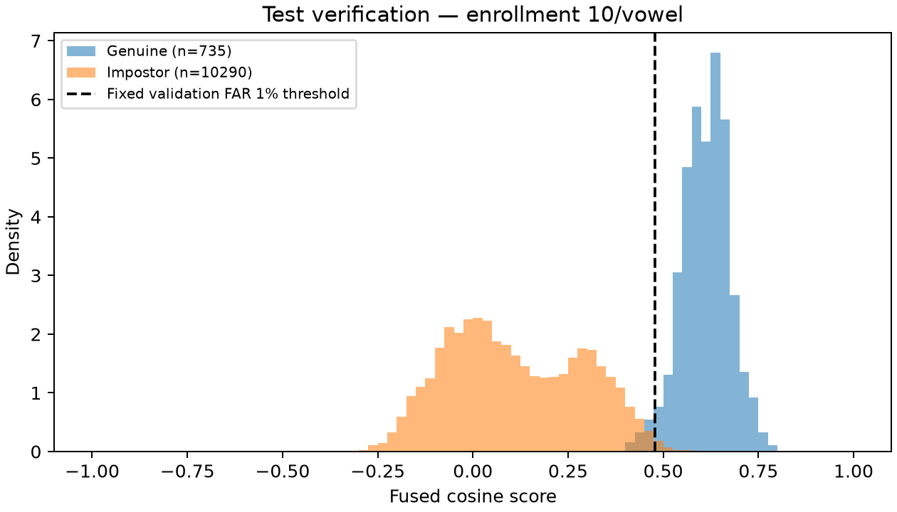
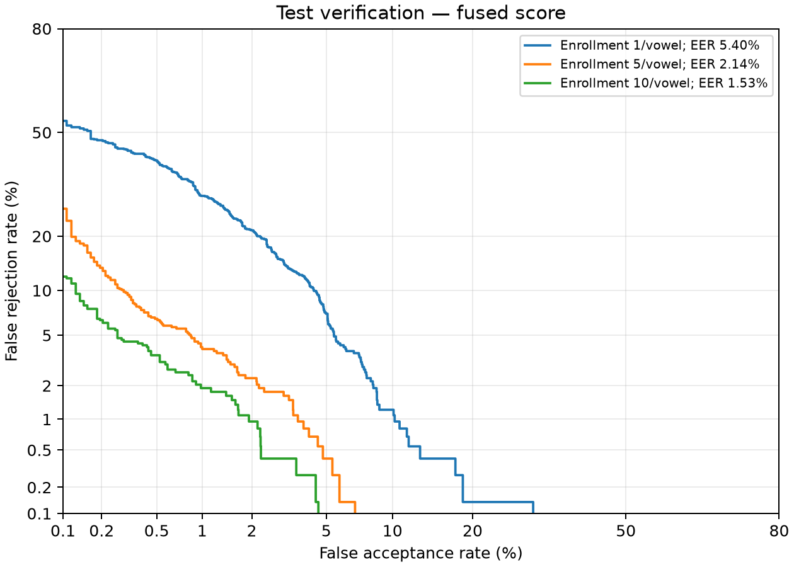

# Phase 6: JVS発話単位の本人照合評価結果

[ブラウザで確認するHTML版](evaluation-results.html)では、グラフと条件別の表を切り替えて閲覧できる。

実行成果物: `artifacts/phoneme-verification-evaluation/jvs-utterance-20261005-v1`。凍結した計画: `artifacts/phoneme-verification-evaluation/jvs-utterance-20261005-v1/evaluation-plan.json`。
評価protocolのSHA-256: `92eee197ea80b1a254082f1b154b2a9b1f9cb480d6e7f3575536aaec7ba66cfd`（評価protocolファイル）。

## 主条件

登録各母音10区間、1発話の全利用可能母音区間、5母音の等重み統合。validationでFAR 1%を目標に決めた閾値をtestへ固定適用した。

- 判定閾値: `0.4782227879111038`
- test他人受入率: **0.729%**（75/10290）。95%話者bootstrap区間: 0.010%〜2.239%。
- test本人拒否率（scoreあり）: **2.585%**（19/735）。95%区間: 0.000%〜7.075%。
- score取得率: **98.000%**（735/750発話）。
- 入力不足も拒否に含めた本人拒否率: **4.533%**（34/750）。95%区間: 2.000%〜8.933%。
- 統合scoreのEER: **1.526%**。95%区間: 0.136%〜2.718%。

## グラフ

青が本人、オレンジが別人、破線がvalidationで固定した判定閾値。scoreを取得できた試行のみを表示する。

他人受入率と本人拒否率の関係を登録区間数別に表示する。左下ほど両方の誤りが少ない。
異文条件を含む全6図のPNG/PDFと元の曲線データは実行成果物の`curves/`に保存した。

## 統合scoreの全条件

すべて同じ登録数のvalidation / verificationから固定したFAR 1%動作点。EERは閾値非依存の分離診断値。

| split | role | 登録区間/母音 | score取得率 | EER | 実測FAR | 条件付きFRR | 全入力FRR |
| --- | --- | ---: | ---: | ---: | ---: | ---: | ---: |
| validation | verification | 1 | 98.000% | 3.751% | 0.991% | 20.952% | 22.533% |
| validation | verification | 5 | 98.000% | 0.700% | 0.991% | 0.544% | 2.533% |
| validation | verification | 10 | 98.000% | 0.476% | 0.991% | 0.272% | 2.267% |
| validation | cross_text_verification | 1 | 87.111% | 4.993% | 0.948% | 29.337% | 38.444% |
| validation | cross_text_verification | 5 | 87.111% | 1.494% | 0.856% | 3.061% | 15.556% |
| validation | cross_text_verification | 10 | 87.111% | 0.948% | 0.784% | 1.020% | 13.778% |
| test | verification | 1 | 98.000% | 5.403% | 0.962% | 30.476% | 31.867% |
| test | verification | 5 | 98.000% | 2.138% | 0.943% | 4.354% | 6.267% |
| test | verification | 10 | 98.000% | 1.526% | 0.729% | 2.585% | 4.533% |
| test | cross_text_verification | 1 | 87.111% | 7.034% | 1.039% | 32.143% | 40.889% |
| test | cross_text_verification | 5 | 87.111% | 1.695% | 1.020% | 4.082% | 16.444% |
| test | cross_text_verification | 10 | 87.111% | 1.257% | 0.838% | 2.041% | 14.667% |

## 母音別の補助結果

母音ごとの平均scoreを同じscoreありquery集合で評価する。母音別の単純平均EERと統合scoreのEERは別物であり、Phase 3の区間単位EERとも直接比較しない。

| role | 登録区間/母音 | score種類 | validation EER | test EER | test FAR | test FRR |
| --- | ---: | --- | ---: | ---: | ---: | ---: |
| verification | 1 | a | 9.796% | 15.909% | 0.534% | 67.755% |
| verification | 1 | i | 13.431% | 17.415% | 2.566% | 52.653% |
| verification | 1 | u | 19.456% | 14.830% | 0.583% | 68.707% |
| verification | 1 | e | 10.748% | 10.282% | 0.632% | 50.476% |
| verification | 1 | o | 11.351% | 12.245% | 2.672% | 48.027% |
| verification | 5 | a | 4.082% | 7.522% | 0.194% | 30.748% |
| verification | 5 | i | 3.401% | 5.442% | 2.682% | 15.782% |
| verification | 5 | u | 8.950% | 8.844% | 1.623% | 38.639% |
| verification | 5 | e | 3.926% | 3.946% | 0.632% | 20.544% |
| verification | 5 | o | 3.071% | 5.607% | 0.573% | 37.279% |
| verification | 10 | a | 3.265% | 3.946% | 0.369% | 20.544% |
| verification | 10 | i | 3.294% | 4.218% | 2.760% | 9.524% |
| verification | 10 | u | 5.850% | 5.986% | 1.118% | 34.558% |
| verification | 10 | e | 2.449% | 3.673% | 0.884% | 14.694% |
| verification | 10 | o | 2.313% | 4.373% | 1.059% | 16.054% |
| cross_text_verification | 1 | a | 9.439% | 14.286% | 0.401% | 68.112% |
| cross_text_verification | 1 | i | 13.958% | 18.021% | 3.371% | 49.235% |
| cross_text_verification | 1 | u | 22.959% | 17.347% | 1.276% | 66.327% |
| cross_text_verification | 1 | e | 12.737% | 14.286% | 0.802% | 49.745% |
| cross_text_verification | 1 | o | 13.375% | 13.448% | 3.316% | 45.153% |
| cross_text_verification | 5 | a | 3.899% | 6.633% | 0.273% | 33.929% |
| cross_text_verification | 5 | i | 4.847% | 7.398% | 3.061% | 21.429% |
| cross_text_verification | 5 | u | 13.520% | 11.990% | 2.660% | 47.959% |
| cross_text_verification | 5 | e | 4.592% | 4.337% | 0.765% | 22.194% |
| cross_text_verification | 5 | o | 4.774% | 6.687% | 1.057% | 40.561% |
| cross_text_verification | 10 | a | 2.442% | 3.316% | 0.364% | 20.918% |
| cross_text_verification | 10 | i | 4.173% | 5.794% | 2.770% | 13.265% |
| cross_text_verification | 10 | u | 11.443% | 10.678% | 2.077% | 42.857% |
| cross_text_verification | 10 | e | 4.082% | 4.665% | 1.148% | 17.092% |
| cross_text_verification | 10 | o | 3.626% | 4.847% | 1.713% | 19.643% |

## 解釈と限界

- 条件付きFAR/FRRはscoreあり試行だけを分母にする。全入力FAR/FRRにはno_scoreも含め、no_scoreは受け入れない。
- validationの目標FARをtestで保証するものではない。testの実測値を見ても閾値を調整していない。
- 95%区間は15話者を単位とする10,000回の共有bootstrap。閾値は固定しており、学習・較正・収録条件の不確かさをすべて含まない。
- JVSの統制収録内で別発話を評価した。収録セッション、別日、別端末、雑音環境の変化への性能は今回確認していない。
- Phase 3で同じtest話者の結果は既に観測済み。今回は固定方式の発話単位・統合scoreの後続評価であり、新しいcorpusによる独立検証ではない。
- 製品向けの合否基準とベースラインは未設定。既存方式との比較はPhase 7で同じtrialを使用する。

## 再現と成果物

`evaluation-plan.json`、`prepared.json`、`checks.json`、`execution.json`で条件・入力・実装・環境・実行のhashを追跡する。登録profile、query、全trial、score、validation閾値、全36条件/splitの集計を保存した。

`metrics/`にはFAR 0.1%とEER動作点、母音別・話者別の結果とtest信頼区間を保存している。`phase5-results/*.jsonl.gz`はscoreあり全trialのPhase 5結果JSONをchecksum付きで保存する。

`curves/`には曲線データとROC・DET・score分布のPNG/PDFを保存する。DETの表示だけは0/1を有限範囲へclipし、保存した曲線データと集計は変更していない。

## 実行記録と検証

2026-10-05に、マージ済みPhase 6設計v1.0.0の条件で実行した。Python 3.12.13、NumPy 2.5.3、torch 2.14.1、matplotlib 3.11.2、CPU/float32/batch=1、torch thread=1、決定論的アルゴリズムを使用。

- Phase 3: 35件、Phase 4: 12件、Phase 5: 16件、Phase 6: 18件、計81件のテストが通過。ruff check、ruff format --check、git diff --checkも通過。
- validationの登録3条件と各話者・roleの本人/別人trial、計63件でcacheなし・入力順逆転の公開API結果とのchecksum一致を確認。
- モデルのパラメータ・特徴統計・profileが不変で、勾配が無効であることを両splitで確認。
- 元WAVの内容hashがtrain/validation/test間で重複しないことを確認。
- 保存したPhase 5結果101,430件すべてのchecksumとscore・query・profileの対応を確認。両split各108動作条件の誤受入れ・誤拒否件数と全入力FRRを保存したscoreから別途再集計し、結果が一致した。実行成果物・凍結済みコードのhashも一致した。
- ROC・DET・score分布の全6図を目視確認した。

| 保存した実行記録 | SHA-256 |
| --- | --- |
| `evaluation-plan.json` | `ce3fc570eda931dcf8aa8943a1be4ba199729a282b2fbf599f89d5fd74969b33` |
| `thresholds/validation.json` | `871f7b17199fbf51ef46f4df139b70c9cdd6a216753573b9ddceda211cbb772d` |
| `scores/validation.jsonl` | `2c8d19da928ba958ffe68275f9dff46f72dce3343a86b081b9ec72b54be70bf7` |
| `scores/test.jsonl` | `5c6dcd324c579ae666838ebf42515e8f25fe4505f46440f004c3740cc99db7f0` |
| `execution.json` | `90c32fe1b9b607b07667cb18f1734f84e5b7ebc3f7b3271d4949d5a268bb05cc` |
| Phase 6実装ファイルのhash一覧（canonical JSON） | `05a683af0e26316a57ebf9ae54dc03ba3a9e4cd8a7e5c7a0b5b6bd2dd7cd99d7` |

`evaluation-plan.json`に凍結したソースファイルのhash一覧を保存した。実行用ソースとlockファイルはその版に一致している。設計書・README・本結果要約の追記は計算方式や凍結設定を変更していない。
